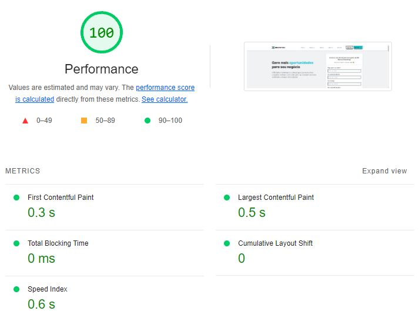
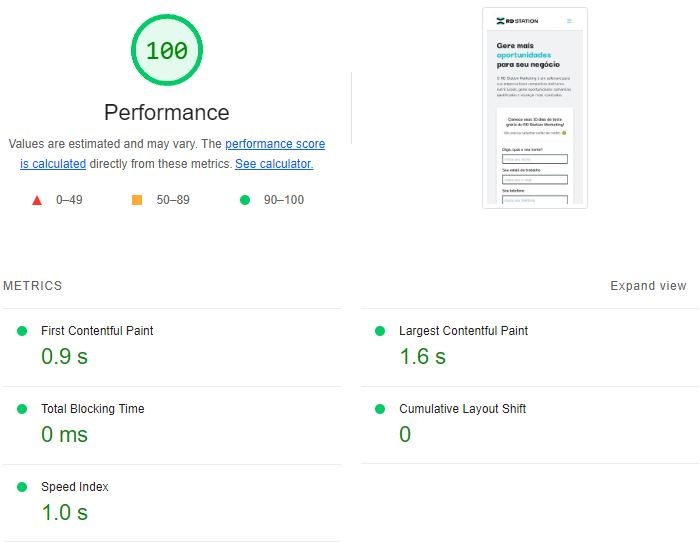

# RD Station Frontend Test

Este projeto é um teste de frontend para a empresa RD Station. Ele apresenta uma interface simples e intuitiva, permitindo que os usuários naveguem através de uma landing page que apresenta as features do RD Station Marketing.

## Seções e funcionalidades

A landing page é apresentada em 6 seções que contém:

- Formulário de criação de usuário para teste grátis
- Lista de features contidas no RD Station Marketing
- Cards/Slider dos principais benefícios do usuário ao utilizar o RD Station Marketing
- Seção de CTA para criação de conta
- Vídeo demonstração de como o RD Station Marketing funciona
- Lista de integrações disponíves

Além de Header com Menu e Footer com redes sociais
## 🚀 Como executar o projeto

### Pré-requisitos

Antes de começar, você vai precisar ter instalado em sua máquina as seguintes ferramentas:
[Git](https://git-scm.com), [Node.js](https://nodejs.org/en/). 
Além disto é bom ter um editor para trabalhar com o código como [VSCode](https://code.visualstudio.com/)


#### 🧭 Rodando a aplicação web (Frontend)

```bash

# Clone este repositório
$ git clone git@gitlab.com:mateusbirtann/rd-station-front-end-test.git

# Acesse a pasta do projeto no seu terminal/cmd
$ cd rd-station-front-end-test

# Instale as dependências
$ npm install

# Execute a aplicação em modo de desenvolvimento
$ npm run dev

# Cria o bundle para publicação
$ npm run build

# Execute a aplicação em modo de produção
$ npm run start

# Executa o conjunto de testes disponível na aplicação
$ npm run test


# A aplicação será aberta na porta:3000/ em desenvolvimento e produção- acesse http://localhost:3000/
```
---

## 🛠 Estrutura de pastas

```
project/
├── src/
│   ├── app/
│   ├── components/
│   ├── data/
│   ├── hooks/
│   ├── schema/
│   ├── sections/
│   ├── services/
│   ├── types/
└── other_files/
```

- components/: Contém componentes reutilizáveis ​​que são usados ​​em várias partes do aplicativo. Por exemplo, um botão de compartilhamento que pode ser usado em várias páginas ou uma barra de navegação que é usada em todas as páginas.
- data/: Contém arquivos de dados estáticos ou recursos usados ​​em várias partes do aplicativo, como JSON ou arquivos de configuração.
- hooks/: Contém hooks personalizados, que são funções reutilizáveis que encapsulam lógica comum para serem usadas em vários componentes do aplicativo. Esses hooks podem incluir lógica de gerenciamento de estado, integração com APIs externas, manipulação de formulários, entre outros.
- schema/: Contém definições de esquemas ou modelos de dados usados ​​pelo aplicativo. Esses esquemas podem ser usados ​​para validar dados, fornecer autocompletar em editores de código ou gerar documentação.
- sections/: Contém lógica de negócios e componentes relacionados a uma funcionalidade específica do aplicativo, como autenticação, carrinho de compras, etc. Nesse caso, as seções da landing page.
- services/: Contém serviços ou utilitários que fornecem funcionalidades específicas para o aplicativo. Isso pode incluir serviços de integração com APIs externas, serviços de armazenamento em cache, serviços de autenticação, etc.
- types/: Contém definições de tipos de dados personalizados usados ​​no aplicativo. Essas definições ajudam a garantir a consistência e a precisão dos dados manipulados pelo aplicativo, além de facilitar o desenvolvimento, fornecendo informações sobre a estrutura dos objetos de dados.

## 🛠 Tecnologias

As seguintes ferramentas foram usadas na construção do projeto, incluindo testes e setup.

#### **Website**

-   **[Next.js](https://nextjs.org/)** - Framework React para renderização do lado do servidor e geração de sites estáticos.
-   **[Tailwind](https://tailwindcss.com/)** - Estrutura CSS de baixo nível que permite estilo direto na marcação.
-   **[Eslint](https://eslint.org/)** - Ferramenta de linting que ajuda a detectar erros e problemas no código.
-   **[Typescript](https://www.typescriptlang.org/)** -  Superconjunto de JavaScript que adiciona tipagem estática e outros recursos.
-   **[Jest](https://jestjs.io/pt-BR/)** -  Framework de teste em JavaScript para testes unitários, integração e snapshot.
-   **[Lucide React](https://lucide.dev/)** - Conjunto de ícones leves e personalizáveis para projetos React.
-   **[React Hook Form](https://react-hook-form.com/)** - Biblioteca que ajuda a gerenciar a validação e o estado dos formulários em aplicativos React.
-   **[Zod](https://zod.dev/)** - Biblioteca para validação e parseamento de dados em JavaScript/TypeScript.
-   **[React Markdown](https://react-hook-form.com/)** - Permite renderizar markdown como componentes React.
-   **[React Resposive Caroulsel](https://www.npmjs.com/package/react-responsive-carousel)** - Componente carrossel responsivo para React.

## ⚡ Performance

Utilizando a ferramenta [Lighthouse](https://developers.google.com/web/tools/lighthouse), podemos avaliar e melhorar a qualidade da nossa aplicação web. O Lighthouse é uma ferramenta open-source automatizada que audita a performance, acessibilidade, práticas progressivas da web, SEO e mais.

Aqui estão os resultados do Lighthouse na última versão do projeto:

### Desktop


### Mobile

